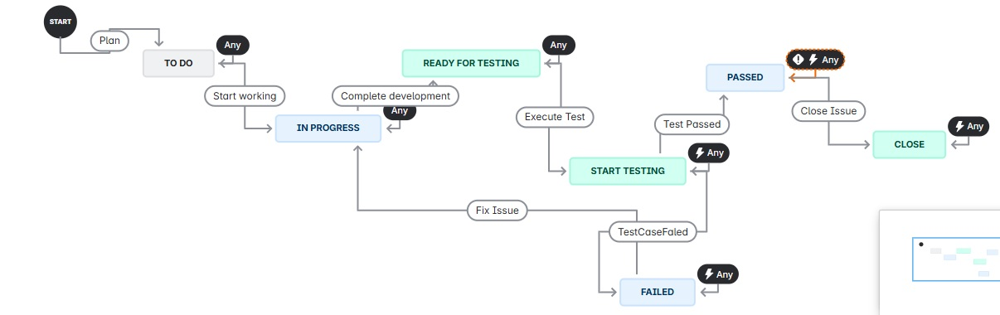

# Web Application Testing & Performance Auditing

#### This project aims to test and optimize a web application "Mark Accountancy" for performance, responsiveness, accessibility, and SEO. We use tools like **Google Chrome DevTools**, **Lighthouse**, and manual verification techniques to ensure the Mark Accountancy web platform delivers a seamless and responsive user experience across various devices and maintains optimal performance in terms of load time and network behavior.

---

##  Requirement Document Summary

A detailed requirement specification document is provided outlining the core features, UI layout expectations, and responsive behavior standards for the Mark Accountancy website. All test scenarios were traced back to specific requirement points to ensure complete coverage and accurate validation. The document also helped identify discrepancies such as the non-responsive headings issue, which was uncovered during conformance testing against these specifications.
[Download the Requirement Specification Document in pdf](Requirement Specification Document.pdf) 

## Test Plan Summary

| Test Area              | Description                                                                 |
|------------------------|-----------------------------------------------------------------------------|
| Functionality Testing  | Validated core functionalities like navigation, form submissions, and links |
| UI/UX Testing          | Verified visual consistency, responsiveness, and accessibility             |
| Performance Testing    | Evaluated page load time and network calls using Chrome DevTools           |
| Cross-Browser Testing  | Performed UI validation across Chrome, Firefox, Safari, and Edge           |
| Cross-Device Testing   | Tested on multiple screen resolutions and mobile devices using BrowserStack|

##  Test Scenarios Covered

###  Functional Tests
- [x] Verify all internal and external links
- [x] Ensure external links open in a new browser tab
- [x] Check if pages navigate to correct URLs
- [x] Validate 404 page for incorrect URLs
- [x] Verify contact form is displayed
- [x] Validate required fields in the contact form:
  - [x] First name
  - [x] Email field
  - [x] Message field
  - [x] Submit button

---

###  UI & UX Tests
- [x] Validate consistent layout and design
- [x] Ensure font and background colors are consistent
- [x] Confirm responsiveness across all screen sizes/devices
- [x] Check alt tags on all images
- [x] Review spelling and grammar in all content
- [x] Examine color contrast for readability
- [x] Ensure favicon links in the footer are clickable

---

###  Cross-Browser & Device Compatibility
- [x] Validate app across all major browsers (Chrome, Firefox, Edge)
- [x] Ensure the page uses correct character encoding
- [x] Validate mobile responsiveness of all pages and the contact form

---

###  Security & SEO
- [x] Check HTTPS security certificate
- [x] Verify meta tag for description
- [x] Confirm meta tag for page indexing and link following
- [x] Check meta tags for social media previews

---

###  Performance Metrics (Core Web Vitals)
Measured using **Chrome DevTools**, **Lighthouse**, and **PageSpeed Insights**.

- [x] Total page load time
- [x] DOM content load time
- [x] Image load times
- [x] **LCP (Largest Contentful Paint)**
- [x] **CLS (Cumulative Layout Shift)**
- [x] **INP (Interaction to Next Paint)** 
- [x] Resource load times

---

##  Tools Used

- Google Chrome DevTools
- Lighthouse Audits
- PageSpeed Insights
- Manual browser/device testing

---

##  Manual Test Cases

**Tool Used**: Microsoft Excel  

>  Excel File: `Test Cases MarkAccountancy.xlsx`

---

##  Bug Found

### Bug Title: **Headings of H1 tag are not responsive across certain device dimensions.**

- **Devices Affected**: Blackberry Z30, iPhone SE, nokia lumia 520  
- **Browsers Affected**: Chrome, Firefox  

### Bug Description:
On certain devices, the main section headings were not resizing or wrapping properly, leading to text overflow or layout distortion.
- **Screenshot available** in '[UI Bug](https://github.com/SanaMubarak01/MarkAccountancy_Manual-Testing-Project/blob/master/UI%20Bug.pdf)' and '[screenshots of 3 screen sizes](https://github.com/SanaMubarak01/MarkAccountancy_Manual-Testing-Project/blob/master/3%20sprints%20-%20MAR%20board%20-%20Scrum%20Board%20-%20Jira.pdf)'

> 
> 
> 

---

## Bug Workflow (STLC in JIRA)

The bug followed a custom **Software Testing Life Cycle (STLC)** implemented in JIRA with the following workflow:

1. **To Do** – Bug identified and logged  
2. **In Progress** – Developer started work on the fix  
3. **Ready for Testing** – Fix moved to QA for validation  
4. **Execute Test Case** – Test cases run for verification  
5. **If Passed → Close the Bug**  
6. **If Failed → Move Back to In Progress**

## Screenshot of the JIRA workflow:

---

